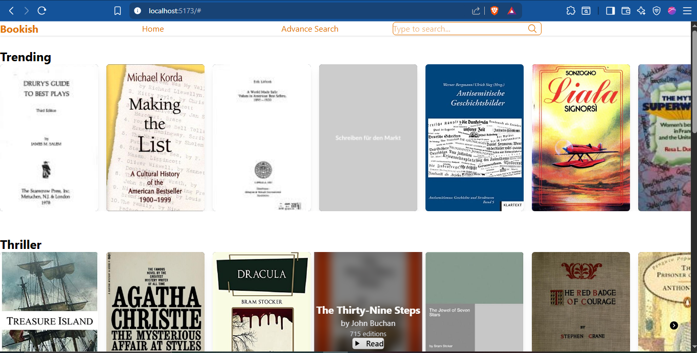
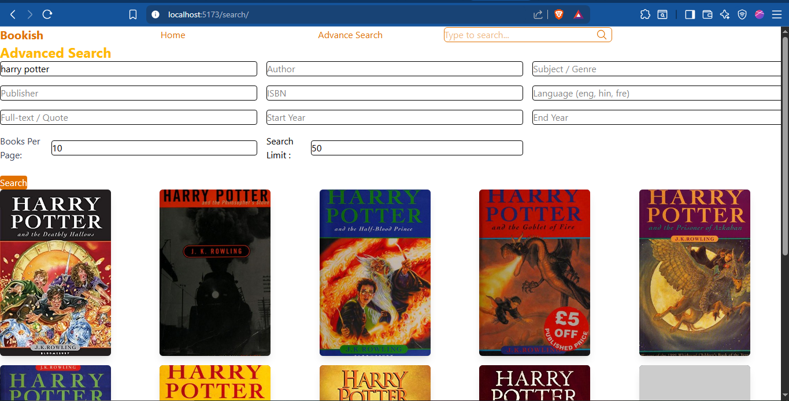
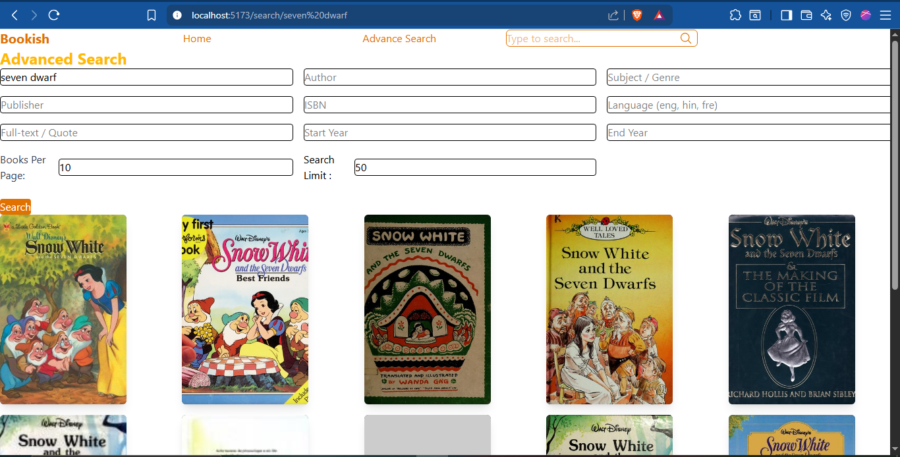

##Bookish 

A modern book search web application that allows users to explore books from OpenLibrary with advanced search features, filters, and pagination — all in a responsive Netflix-style layout.

## Problem

Finding relevant books online can be tedious. Users often need to search using multiple criteria such as title, author, genre, publication year, or even keywords/quotes inside a book. Existing platforms may not provide a simple, responsive interface with flexible filtering and pagination.

## Approach

Utilize OpenLibrary API to fetch book metadata and images.

Build an Advanced Search form supporting multiple fields: title, author, subject, publisher, ISBN, language, year range, full-text/quotes.

Implement client-side pagination and allow users to set the number of books per page.

Create a responsive, modern UI with Netflix-style horizontal scroll rows and TailwindCSS styling.

Allow direct URL-based search (e.g., /search/harry+potter) for easy sharing of search results.

## Overview of this project

 **Homepage** : Show trending books, categories like Thriller, Kids, Romance, Spy in a horizontal scroll row.

**Book Cards** : Displays cover, title, author, edition/pages info, with hover overlay and a “Visit” button linking to OpenLibrary.

**Advanced Search** : Search by multiple fields including title, author, subject, publisher, ISBN, language, year range, full-text search, and books-per-page.

**Pagination** : Navigate between pages of results with Next/Previous buttons.

**Responsive design** : Works on desktop, tablet, and mobile screens.

## Installation Guide

Clone the repository:

git clone https://github.com/rishabh480604/bookish.git
cd bookish


Install dependencies:
```js

npm install
```


Start the development server:
```
npm run dev
```


Open the app:

Go to http://localhost:3000 in your browser.

## Tech Stack

**Frontend** : React.js, React Router, TailwindCSS

**API** : OpenLibrary API

**State Management** : React useState & useEffect

**Styling & Responsiveness** : TailwindCSS

Screenshots

**Homepage** : 

**Advanced Search** :


**By  Search in navbar** :



Pagination

## LLM link
- https://www.perplexity.ai/search/conrtext-general-guidelines-yo-TXl2kjXkTgm8ew4G8UJSJA#6
- https://chatgpt.com/share/68d7d933-8de4-8013-9872-79c208c113ac